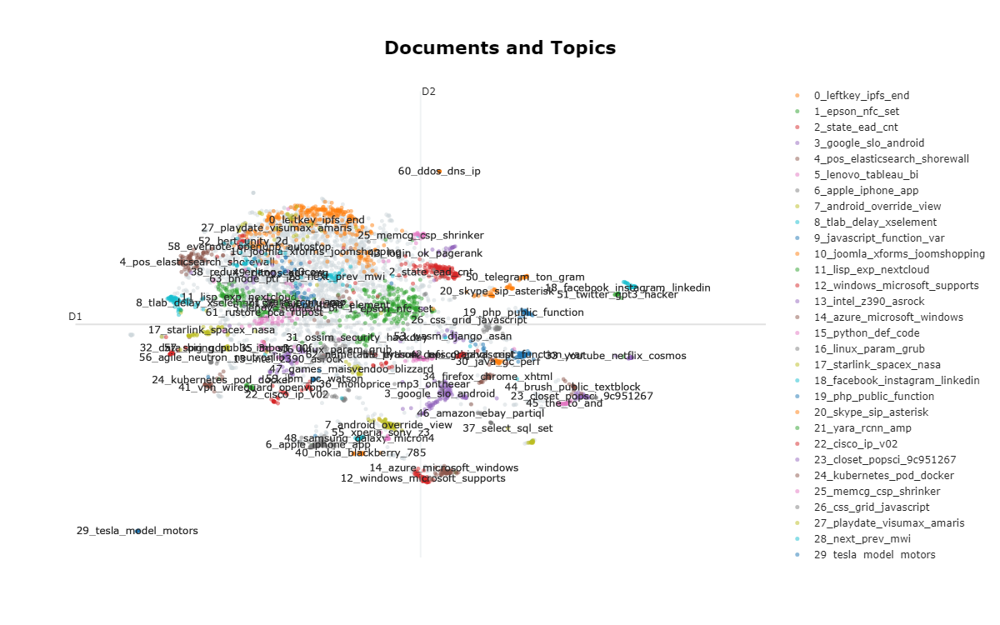
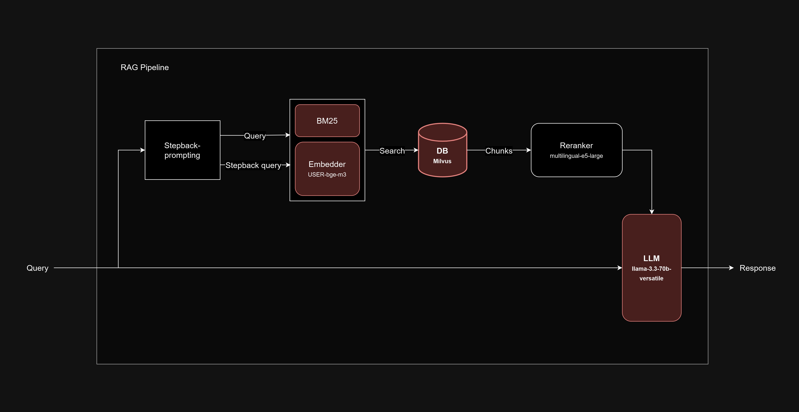

# Habr_RAG
Курс "Введение в LLM". ITMO University. Ai Talent Hub.

## Команда
<b>Название:</b> `т.чка` \
<b>Участники:</b>
- Щетинников Константин Дмитриевич
- Кравцов Владимир Михайлович
- Корнилова Валерия Александровна

## Проект "Habr RAG"
### Описание проекта
Система Retrieval-Augmented Generation (RAG), которая помогает пользователю задавать вопросы в любой форме и получать ответы на основе статей Хабра.

### Данные
<b>Краткое описание:</b>\
Набор данных постов и комментариев с habr.com , российского коллективного блога об ИТ, компьютерных науках и всем, что связано с Интернетом.

<b>Размер:</b> ~300 000 документов\
<b>Языки:</b> русский, английский, немного программного кода.\
<b>Статистика:</b>
- Длина документов:
    - Max length: 301 996
    - Min length: 152
    - Average length: 7732.74
- Топ-10 тем:
    - javascript
    - python
    - android
    - google
    - linux
    - программирование
    - java
    - разработка
    - apple
    - microsoft
<div>
    
<div>

<b>Выводы:</b>
- язык преимущественно русский
- домен только IT, computer science, Internet. Можно попробовать парсинг сайта harb.com
- большой датасет
- в силу разной длины документов, необходимо их разбить на чанки

### Подготовка
<!-- 1. Для инициализации BM25 был собран корпус из 10 000 текстов. Такого размера корпуса достаточно для эффективной работы модели. Корпус сохранен в файл `corpus.csv` -->
Для быстрого поднятия приложения данные были предварительно обработаны:
- разбиты на чанки
- векторизованы в плотные матрицы
- сохранены в файл `harb20.db`

### Pipeline

#### Особенности
В нашем пайплайне мы применяем stepback-prompting основного запроса. Это позволяет найти в базе дополнительные чанки. На выходе используется реранкер для фильтрации более релевантных чанков.
<!-- Также, сам поиск осуществляется в гибридном формате: на основе векторов и ключевых слов.  -->

#### Шаги
1. Stepback-prompting основного запроса
2. Основной запрос и stepback-запрос векторизуются в плотные матрицы
3. Матрицы передаются векторному хранилищу данных. Осуществляется поиск `k=5` релевантных чанков для каждого запроса.
4. Найденные чанки реранжируются.
5. Найденные чанки передаются LLM и генерируется ответ.
<div>
    
<div>

#### Компоненты
- Эмбеддер (dense vectors) - `USER-bge-m3`
- Векторное хранилище - `Milvus`
- Реранкер - `Multilingial-e5-large`
- LLM - `Llama-3.3-70b-versatile`
<!-- - BM25 (sparse vectors) -->


### Валидация и тестирование
Видео тестового запуска: `./content/video.mp4`

### Метрики
Скрипты и выборка для тестировани находится в директории ./testing

| Metric  | Result  |
|---|---|
| Response vs input | 0.95 |
| Response vs retrieved docs | 0.76 |
| Retrieved docs vs input | 0.8 |

### Инструкция по запуску
1. Создать директорию `./storage/data`, скачать файл `habr20.db` и добавить в созданную папку.\
Файлы для скачивания: [ссылка](https://disk.yandex.ru/d/782ejhiiQc3z7A)
2. Чтобы запустить приложение, выполните команды:
```
uvicorn server.app:app
```
```
streamlit run client/app.py
```
